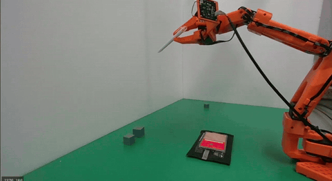

<div align="center">

# 🦾 JARVIS

### Tool-Latent Conditioned RL for Zero-Demo VLA Fine-Tuning

*Teaching a low-cost SO-101 arm to pick, place, and hand over tools — with **zero human demonstrations**.*

<br>


<br><br>

`SmolVLA-450M` · `Isaac Lab` · `Uni3D` · `Dr. Eureka RL` · `SO-101` · `LeRobot`

*Yonsei AI (YAI) · YAICON 2026*

</div>

---

## TL;DR

Human teleoperation on a low-cost arm is expensive, exhausting, and doesn't transfer — 50 demos give **0%** pick-and-place success, and zero-shot VLA fails in both real and sim. JARVIS replaces the demonstrations entirely: it trains a **tool-conditioned RL policy** in simulation, conditioned on a frozen **Uni3D** tool-geometry latent `z`, then rolls that policy out to auto-generate the training data a VLA needs. One policy generalizes to **unseen tools** through their latent vector — no new demos required.

> **Point cloud in → deployable VLA out.** The whole pipeline runs automatically.

---

## Why this exists

<table>
<tr>
<td width="55%">

**Gathering demos is tiring and brittle.**
- A teleop rig (ALOHA-class) runs ~**$20K**, and you still have to physically perform every demonstration — opening a lid 500 times by hand.
- Demos only cover *that* specific space and *those* specific tools. Embodiment changes (GELLO → ALOHA) don't transfer.
- Zero-shot VLA? Terrible — in **real and in sim**.

**So why not generate the trajectories in simulation?**
Millions of demos in minutes, in any environment, for any tool.

</td>
<td width="45%">

 

<sub>Real SO-101 setup. 50 teleop demos → **0%** pick-and-place success; the stepwise keyboard teleop produces non-coordinated trajectories a VLA can't learn from.</sub>

</td>
</tr>
</table>

---

## Approach

Two objectives drive the design:

1. **Zero-demo fine-tuning** — solve the *tiring* problem with Dr. Eureka-based RL instead of human demos.
2. **Tool / environment-agnostic** — solve the *distribution* problem with a tool-latent conditioned policy.

### Stage 1 — Pipeline Preparation

Train a single tool-conditioned RL policy `π(a | s, z)` on **K=8 representative tools**.


`Dr. Eureka reward` → `Uni3D encode (frozen)` → `K-means representatives` → `tool-conditioned PPO`

### Stage 2 — Adapting to a New Tool

Zero-demo adaptation: an unseen tool's point cloud goes in, a fine-tuned VLA comes out.


`new tool` → `encode to zₙₑw` → `short RL adaptation` → `sim rollouts` → `SmolVLA fine-tune`

---

## The tool latent space

Tool geometry is the prior. We encode Objaverse-XL tool point clouds with a **pretrained, frozen Uni3D** encoder, reduce to **64-d via PCA** (79.5% variance retained), and cluster with K-means. Only the **cluster representatives** need a grasp annotation — annotation scales with the number of clusters `O(K)`, not the number of tools `O(N)`.


<sub>Left: 3D UMAP of the tool latent space (wrench · pliers · pocketknife · soupspoon · mallet · shovel · screwdriver · pencil). Right: cluster-quality map — 8 clean clusters kept, 3 loose/impure ones dropped.</sub>

---

## Results

> Presented at **YAICON 2026** (Yonsei AI).

### A single latent prior collapses scratch RL from 5,000 iterations to ~100


Across **100 held-out (OOD) tools**, the tool-latent policy converges at **~115 iterations** while a from-scratch baseline stays effectively flat — and gives up entirely (0% at 5,000 iters) on **37%** of tools.

<div align="center">

| | Tool-latent prior (ours) | Scratch + Dr. Eureka |
|---|:---:|:---:|
| **Success @ 115 iter** | **97%** | 3% |
| **Adaptation speed** | **~50× faster** | — |
| **Tools never solved** | — | 37% (0% @ 5,000 iter) |

</div>

### A deployed SmolVLA generalizes spatially once coverage crosses ~60%


Sweeping the training-region ratio, the fine-tuned SmolVLA hits **100% inside the training region at every ratio**. Out-of-distribution positions reach **100% once the training region covers ~60%** of the workspace — and even a tiny 15% region already gives a non-trivial **28%** OOD success.

### From new tool to deployed policy — automatically

<table>
<tr>
<td width="50%" align="center">

<br><sub><b>Dr. Eureka RL</b> — verified cube pick-and-place</sub>
</td>
<td width="50%" align="center">

<br><sub><b>New-tool warm-start</b> — adapts in ~100 iterations</sub>
</td>
</tr>
</table>

The adapted policy is rolled out for **500 episodes in ~20 minutes**, uploaded to HuggingFace in LeRobot v3 format, and used to fine-tune **SmolVLA-450M** (LoRA + 4-bit) on a Colab A100.

---

## Pipeline at a glance

```
Objaverse-XL tool point cloud
   └─▶ Uni3D (frozen) ─▶ PCA-64 latent z ─▶ K-means (K=8 reps)
          └─▶ Dr. Eureka reward ─▶ tool-conditioned PPO  π(a|s,z)   [Isaac Lab, 4096 envs]
                 └─▶ 500-episode rollout ─▶ LeRobot v3 dataset ─▶ HuggingFace
                        └─▶ SmolVLA-450M fine-tune (LoRA + 4-bit, Colab A100)
                               └─▶ sim deploy  (deg→rad action wrapper)
                                      └─▶ (upside) real SO-101 lightbox transfer
```

Full stage-by-stage breakdown with verification status: **[PIPELINE.md](PIPELINE.md)**.

---

## Repository layout

```
JARVIS/
├── tool_latents/        # Uni3D encoding, PCA-64, K-means clustering
│   ├── build_tool_latents.py
│   ├── cluster_tools.py
│   └── encode_new_tool.py
├── rl/                  # Isaac Lab tool-conditioned RL  (task: JarvisMultiTool-v0)
│   ├── jarvis_env.py
│   ├── tool_env_cfg.py
│   ├── mdp_rewards.py
│   ├── mdp_terminations.py
│   └── train.py
├── grasp_transfer/      # cluster-supervised grasp specification for new tools
│   ├── relative_grasp.py
│   └── verify_grasp.py
├── data_pipeline/       # RL rollouts → LeRobot v3 dataset
│   └── convert_raw_to_lerobot.py
├── vla/                 # SmolVLA action wrapper (degree→radian)
│   └── smolvla_wrapper.py
├── eval/                # trajectory diversity (signature kernel + Vendi score)
│   └── diversity_analysis.py
├── sage_sim2real/       # archived SAGE attempt: sim-to-real actuator-gap compensator (see below)
├── docs/                # setup, architecture, positioning
└── assets/              # figures + demo clips
```

---

## Quickstart

```bash
# 1. Build the tool latent space (Uni3D frozen → PCA-64 → K-means)
python tool_latents/build_tool_latents.py --pointclouds data/objaverse_tools --out models/
python tool_latents/cluster_tools.py --latents models/tool_latents.npy --k 8

# 2. Train the tool-conditioned policy (Windows-native Isaac Lab)
isaaclab.bat -p rl/train.py --task JarvisMultiTool-v0 --num_envs 4096 --headless

# 3. Encode a new tool and warm-start adapt
python tool_latents/encode_new_tool.py --pointcloud data/new_tool.ply --pca models/pca_model_dim64.pkl
isaaclab.bat -p rl/train.py --task JarvisMultiTool-v0 --resume --tool new_tool --max_iter 100

# 4. Roll out → LeRobot dataset → HuggingFace
python data_pipeline/convert_raw_to_lerobot.py --rollouts logs/rollouts --repo davekim0323/jarvis-<tool>-v1

# 5. Fine-tune SmolVLA (Colab A100) then deploy in sim
python vla/smolvla_wrapper.py --checkpoint <smolvla_ckpt> --task JarvisMultiTool-v0
```

> Isaac Sim / Isaac Lab must run **Windows-native** (see [docs/setup.md](docs/setup.md)). WSL2 is used only for SmolVLA inference / ROS2.

---

## Stack

| Component | Choice |
|---|---|
| Simulation | Isaac Sim 5.1 + Isaac Lab 2.3.0 |
| RL | RSL-RL PPO, Dr. Eureka reward generation |
| Tool encoder | Uni3D (pretrained, frozen) → PCA-64 |
| VLA | SmolVLA-450M (LoRA + 4-bit) |
| Hardware | SO-101 5-DoF arm + gripper |
| Data format | LeRobot v3 |
| Tools dataset | Objaverse-XL (tool categories) |

---

## Future work

- **Real-world transfer** — sim-to-real on the NVIDIA lightbox (the vision domain is the narrow case where transfer is most plausible). The real SO-101 in the lightbox is shown below.
- **Domain randomization via NVIDIA Cosmos Transfer 2.5** — photorealistic augmentation to widen the visual training distribution.

<div align="center">

<br><sub>The real SO-101 (3D-printed) in the green lightbox — the same environment used in simulation.</sub>
</div>

---

## SAGE — sim-to-real actuator-gap compensator

 A low-cost SO-101 servo arm doesn't land exactly where a policy commands it — static bias, direction-dependent backlash, tracking lag. So we tried the concept behind NVIDIA's unreleased **SAGE + GapONet + GR00T** integration: measure that sim↔real gap with SAGE, learn a small **residual compensator** that pre-corrects each command, and splice it into the GR00T deploy loop as an action-space wrapper — without touching the GR00T model.

We built the offline pipeline — SAGE CSV → unit/rate harmonization → residual MLP → TorchScript export — and trained it on real SO-101 data we collected. On a chronological held-out split it cut per-joint tracking RMSE by ~**56–67%** (e.g. `shoulder_lift` 3.9° → 1.3°). This stayed offline; we didn't wire it into the live deploy loop, so it wasn't run on the arm in the loop.

Contents of [`sage_sim2real/`](sage_sim2real/): `tools/` (feature spec + converter + trainer), `runs/` (models + reports on real data), `data/output_bong/` (the collected SAGE data)

---

## Team

JARVIS 조 — Yonsei AI (YAI). Mechanical-engineering roots, which is exactly why we care about *tools*. Inspired, of course, by Iron Man's JARVIS.

<div align="center">
<br>
<i>Point cloud in. Deployable policy out. No demos.</i>
</div>
